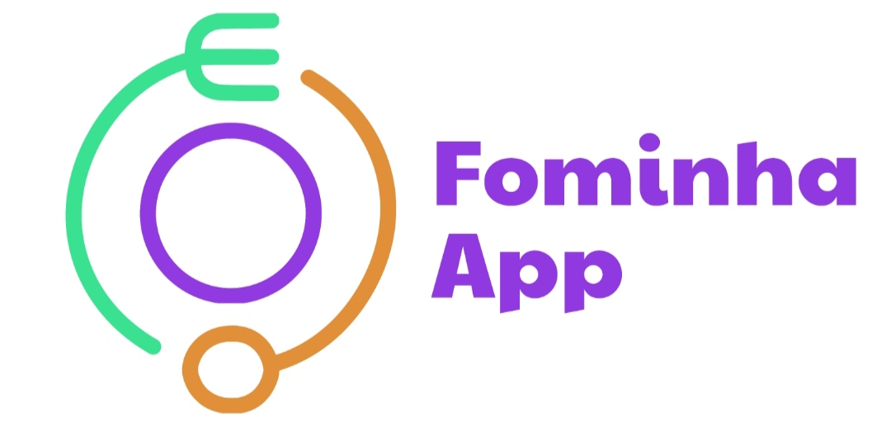
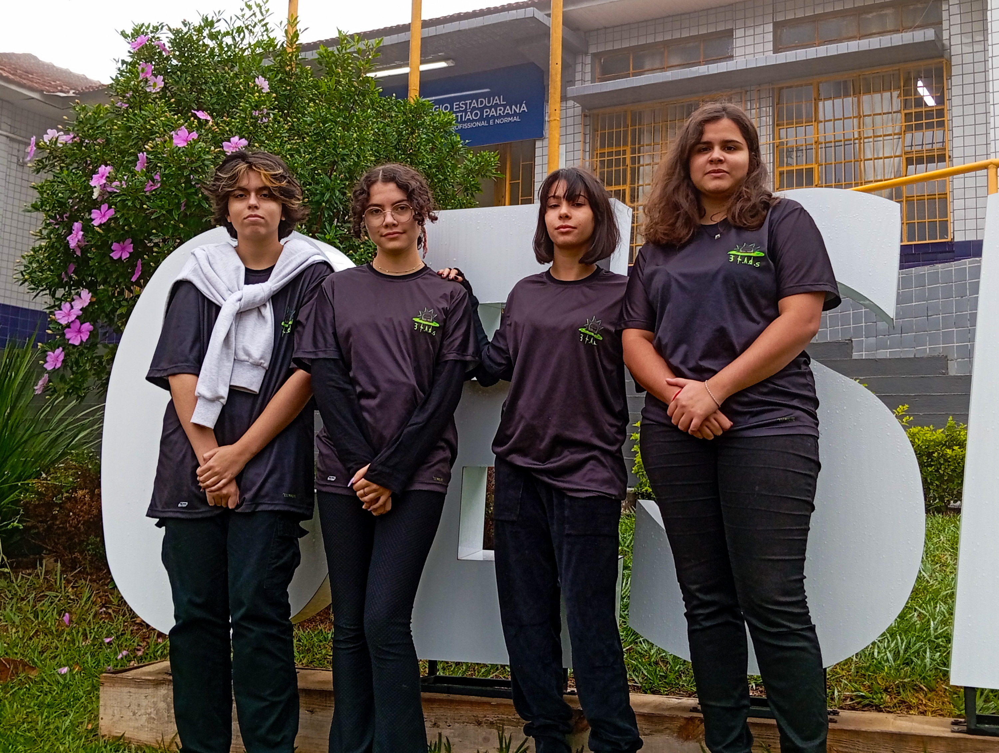
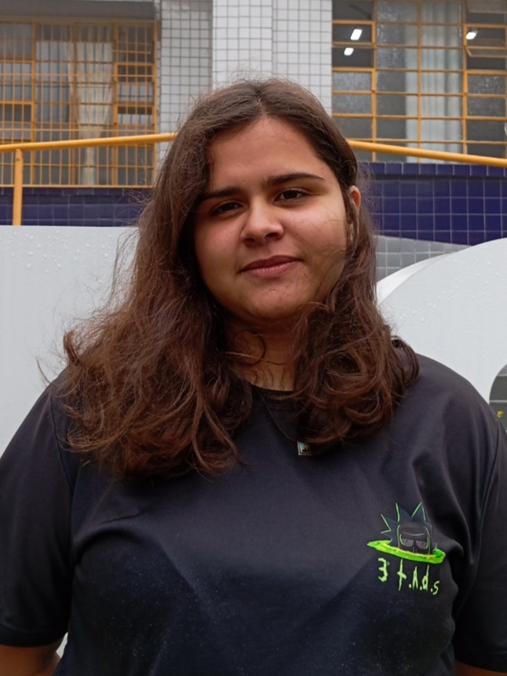
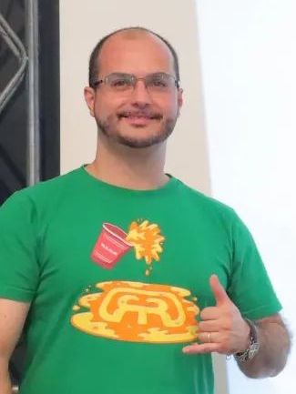
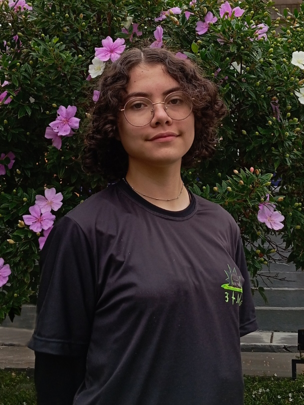
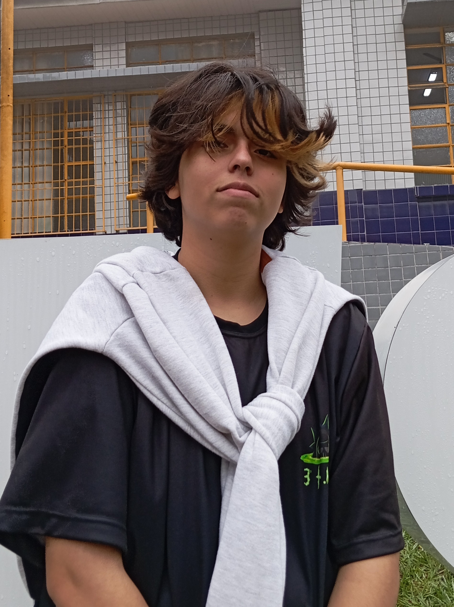

# Projeto FominhaApp

O FominhaApp é um projeto que tem como objetivo reduzir o desperdício de alimentos nas escolas. Ele permite que os alunos votem se pretendem fazer a refeição daquele dia, e possibilita deixar um feedback de suas preferências em relação à merenda. Com essa iniciativa, buscamos não apenas minimizar o desperdício, mas também incentivar a participação dos estudantes na construção de um ambiente escolar mais sustentável.

# Etapas

O projeto ainda está em constante desenvolvimento, mas, já temos algumas tarefas concluídas:

- [x] Desenvolvimento do Aplicativo.
- [x] Testes
- [x] Criação da logo.
- [x] Criação das redes sociais.
- [x] Primeiro contato com os alunos na escola piloto.
- [x] Apresentação da equipe e divulgação do nome.
      
 

# 💻 Harvest

Harvest significa colheita, e evoca a ideia do uso eficiente de recursos.
> 
> Heroes
> 
> Against
> 
> Resource
> 
> Waste
> 
> Enabling
> 
> Sustainable
> 
> Transformation

"Heróis contra o desperdício de recursos, permitindo a transformação sustentável "

# Equipe Harvest 

<table>
  <tr>
    <td align="center">
      <a href="#" title="defina o titulo do link">
         
        
          <b>Graziela Santos</b> 
        
      </a>
    </td>
   <td align="center">
      <a href="#" title="defina o titulo do link">
         
        
          <b>Geovana Domingos</b>  
        
      </a>
    </td>
    <td align="center">
      <a href="#" title="defina o titulo do link">
         
        
          <b> Kheronn Machado</b>  
        
      </a>
    </td>
    <td align="center">
      <a href="#" title="defina o titulo do link">
         
        
          <b>Maria_Vitória Sabater</b>  
        
      </a>
    </td>
   <td align="center">
      <a href="#" title="defina o titulo do link">
         
        
          <b>Maria_Clara Fabro </b>  
        
      </a>
    </td>
  </tr>
</table>
<b>Funções</b>  

<b>Geovana:</b> Criadora de conteúdos e administração.  

<b>Graziela:</b> Progamadora Front-End  

<b>Maria Clara:</b> Desing  

<b>Maria Vitória:</b> Social Mídias 

<b>Kheronn Machado:</b> Orientador   
